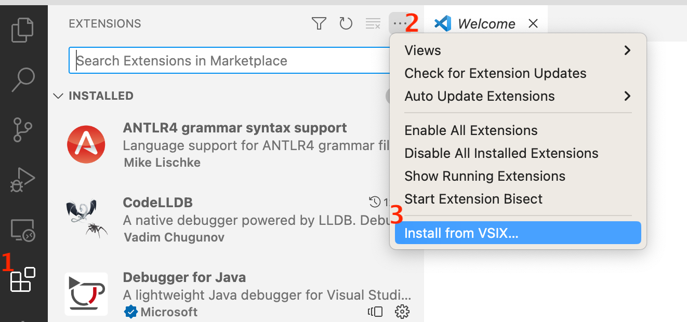

# Abs support for Visual Studio Code

This repository adds support for the Abs language in Visual Studio Code.

## Features

Syntax highlighting and compiling single-file models.

## Configuration

To compile ABS code inside VS Code, set the following options:

- `abs.compileCommand`: If the `absc` command is not in your path, set this
  option to the command that starts the ABS compiler.
- `abs.backend`: One of `--erlang`, `--java`, `--maude`.
- `abs.compileOptions`: This contains a list of options to pass to the
  compiler.  See the output of `absc -h` for a list of applicable options.

Note: to run the ABS compiler from a Jar file (typically `absfrontend.jar`)
instead of via the `absc` script, set `abs.compileCommand` to `java` and add
two items to `abs.compileOptions`: `-jar` and `/path/to/absfrontend.jar`.

## Installing

To install the latest released version, download the `.vsix` file from https://github.com/abstools/abs-vs-code/releases/latest (currently `abs-0.0.8.vsix`).
   
### Installing from the Command Line

Run `code --install-extension abs-0.0.8.vsix`

### Installing from inside Visual Studio Code

1. Open the Extensions list in the left-hand column.

2. Choose "Install from VSIX..." from the three-dotted  menu (`...`) on the upper right hand side of the extensions list:

   <picture>
   
   </picture>

3. In the file browser, choose the `abs-0.0.8.vsix` file downloaded from https://github.com/abstools/abs-vs-code/releases/latest .

### Running an unreleased version

To use the extension from a git checkout, copy the `abs/` subdirectory into
your `~/.vscode/extensions` directory, e.g., with the following commands:

    cd ~/.vscode/extensions
    cp -r /path/to/abs-vs-code/abs abs

## Development

To run the current source, open the `abs/` subfolder inside VS Code and press
`F5` (Run -> Start Debugging).

To create a `.vsix` package, install [node](https://nodejs.org/en) then run
the following commands:

    npm install
    cd abs
    vsce package

